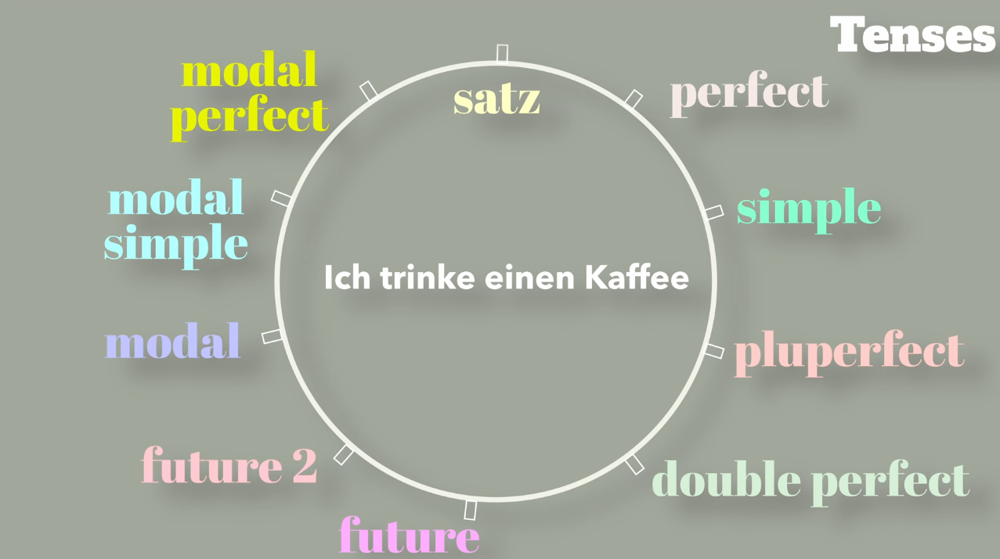
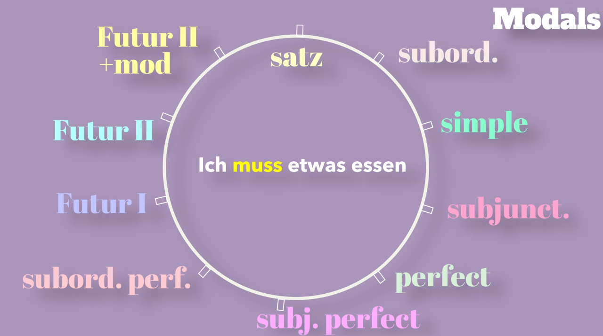

Learning German but have no one to practice with? You absolutely **can** talk to yourself effectively! This proven method will help you take your German up a notch all by yourself using sentence transformation templates.

Deutsch: `Du kannst alleine Deutsch üben! Diese Methode hilft dir, deine Deutschkenntnisse durch Satzumwandlung zu verbessern.`

---

## Why Solo Practice Works

When you don't have conversation partners, you need **structured practice methods**. The key is starting with one simple sentence and gradually adding complexity through **three skill areas**:

1. **Sentence Structure** (Word Order)
2. **Different Tenses** 
3. **Modal Verbs**

Each drill builds your **muscle memory** for German grammar patterns, training your brain to construct sentences naturally.

---

## Method 1: Sentence Structure Building

**Goal:** Master German word order by gradually adding elements

### The Progressive Circle Method

Start simple and add one element at a time. By the end, you'll handle complex sentences effortlessly.


#### Step 1: Base Sentence
```
Ich trinke einen Kaffee.
(I'm drinking a coffee.)
```

#### Step 2: Add Time Phrase (WHEN)
```
Heute Nachmittag trinke ich einen Kaffee.
(This afternoon I'm drinking a coffee.)
```

**Other time phrases to practice:**
- `jeden Morgen` (every morning)
- `manchmal` (sometimes)  
- `um 3 Uhr` (at 3 o'clock)
- `normalerweise` (usually)

#### Step 3: Add Manner Phrase (HOW)
```
Heute Nachmittag trinke ich mit Freunden einen Kaffee.
(This afternoon I'm drinking coffee with friends.)
```

#### Step 4: Add Place Phrase (WHERE)
```
Heute Nachmittag trinke ich mit Freunden einen Kaffee bei Starbucks.
(This afternoon I'm drinking coffee with friends at Starbucks.)
```

#### Step 5: Connect Clauses

**Coordinating conjunction (und, aber, oder):**
```
Heute Nachmittag trinke ich mit Freunden einen Kaffee bei Starbucks, und dann gehen wir ins Kino.
```

**Subordinating conjunction (weil, dass, obwohl):**
```
Ich trinke mit Freunden einen Kaffee bei Starbucks, weil ich müde bin.
```

#### Step 6: Add Modal Verbs
```
Heute Nachmittag möchte ich mit Freunden einen Kaffee bei Starbucks trinken.
```

#### Step 7: Use Subjunctive (Conditional)
```
Heute Nachmittag würde ich gerne mit Freunden einen Kaffee bei Starbucks trinken.
```

### Practice Tip
**Remember the German word order rule:** **T**ime, **M**anner, **P**lace (TeKaMoLo: **Te**mporal, **Ka**usal, **Mo**dal, **Lo**kal)

---

## Method 2: Tense Transformation Drill

**Goal:** Master all German tenses using one sentence



### Base Sentence
```
Ich trinke einen Kaffee.
(I drink/am drinking coffee.)
```

### Moving Through Time

#### Present → Perfect Tense
```
Ich habe einen Kaffee getrunken.
(I have drunk/drank coffee.)
```

#### Perfect → Simple Past (Präteritum)
```
Ich trank einen Kaffee.
(I drank coffee.)
```

#### Simple Past → Past Perfect (Plusquamperfekt)
```
Ich hatte einen Kaffee getrunken.
(I had drunk coffee.)
```

#### Past Perfect → Double Perfect (Doppelperfekt)
```
Ich habe einen Kaffee getrunken gehabt.
(I had drunk coffee - Southern German)
```

#### Present → Future I
```
Ich werde einen Kaffee trinken.
(I will drink coffee.)
```

#### Future I → Future II
```
Ich werde einen Kaffee getrunken haben.
(I will have drunk coffee.)
```

### With Modal Verbs

#### Present with Modal
```
Ich muss einen Kaffee trinken.
(I have to drink coffee.)
```

#### Past with Modal
```
Ich musste einen Kaffee trinken.
(I had to drink coffee.)
```

#### Perfect with Modal
```
Ich habe einen Kaffee trinken müssen.
(I have had to drink coffee.)
```

**Notice:** Two infinitives at the end! This is the **perfect tense of modals**.

---

## Method 3: Advanced Modal Verb Combinations

**Goal:** Master complex modal verb constructions



### Base Sentence
```
Ich esse etwas.
(I eat something.)
```

### Progressive Complexity

#### Step 1: Subordinate Clause
A subordinate clause is a part of a sentence that depends on the main clause and is introduced by words like "dass" (that), "weil" (because), or "wenn" (if).
```
Ich denke, dass ich etwas essen muss.
(I think that I have to eat something.)
```

#### Step 2: Simple Past Modal
```
Ich dachte, dass ich etwas essen musste.
(I thought that I had to eat something.)
```

#### Step 3: Subjunctive II
Subjunctive II (Konjunktiv II) is a *German verb form* used to express hypothetical situations, wishes, or polite requests.
```
Ich müsste etwas essen.
(I should/would have to eat something.)
```

#### Step 4: Perfect Modal
```
Ich habe etwas essen müssen.
(I have had to eat something.)
```

#### Step 5: Perfect Subjunctive
```
Ich hätte etwas essen müssen.
(I should have eaten something.)
```

#### Step 6: Subordinate Clause with Perfect Subjunctive
```
Ich denke, dass ich etwas hätte essen müssen.
```

**Notice:** The conjugated verb `hätte` squeezes between the infinitives!

#### Step 7: Future with Modal
- Future I (Futur I) is the German tense used to express actions that will happen in the future, similar to "will" in English.
```
Ich werde etwas essen müssen.
(I will have to eat something.)
```

#### Step 8: Future II with Modal (Super Advanced!)
Future II (Futur II) is used to express that an action will have been completed by a certain point in the future, while Future I (Futur I) simply states that an action will happen.
```
Ich werde etwas gegessen haben müssen.
(I will have had to have eaten something by then.)
```

This expresses high probability about a past necessity!

---

## Level-Based Practice Guide

### Beginners (A1-A2)
**Focus on:** First 3 steps of sentence building
- Base sentence
- Add time phrase
- Add manner phrase

**Example progression:**
1. `Ich lerne Deutsch.`
2. `Heute lerne ich Deutsch.`
3. `Heute lerne ich mit Freunden Deutsch.`

### Intermediate (B1-B2)
**Focus on:** Complete sentence building + basic tenses
- All sentence structure steps
- Present, perfect, and simple past
- Basic modal verbs

**Challenge:** Get halfway through both drills

### Advanced (C1-C2)
**Focus on:** Complete all transformations
- Complex subordinate clauses
- All tenses including subjunctive
- Advanced modal combinations

**Challenge:** Master the entire circle!

---

## Your Solo Practice Routine

### Daily 15-Minute Session

1. **Choose your daily verb** (use verbs you encounter often)
2. **Start with a simple sentence**
3. **Work through the transformations**
4. **Say everything out loud** (this is crucial!)
5. **Focus on speed and fluency**

### Weekly Focus Areas

- **Monday/Wednesday/Friday:** Sentence structure building
- **Tuesday/Thursday:** Tense transformations  
- **Saturday:** Modal verb combinations
- **Sunday:** Review and combine all methods

### Sample Verbs to Practice With

**A1 Level:**
- `machen` (to make/do)
- `gehen` (to go)
- `kaufen` (to buy)
- `arbeiten` (to work)

**A2 Level:**
- `verstehen` (to understand)
- `vergessen` (to forget)
- `bekommen` (to receive)
- `erzählen` (to tell)

**B1+ Level:**
- `sich vorstellen` (to imagine)
- `entscheiden` (to decide)
- `diskutieren` (to discuss)
- `organisieren` (to organize)

---

## Pro Tips for Success

### 1. Speed Matters
Train yourself to move through variations **quickly**. The goal is **automaticity**, not perfection.

### 2. Understand Every Sentence
Don't just recite - make sure you know **what you're saying** and **why** the grammar works.

### 3. Record Yourself
Use your phone to record practice sessions. Listen back to identify patterns and mistakes.

### 4. Use Real-Life Contexts
Base your sentences on **your actual daily activities**:
- `Ich trinke Kaffee` → Your morning routine
- `Ich arbeite am Computer` → Your work day
- `Ich koche Abendessen` → Evening activities

### 5. Combine with Past Participle Practice
Use this method to reinforce **Partizip Perfekt** patterns from your grammar studies!

---

## Common Mistakes to Avoid

### 1. Wrong Word Order in Time-Manner-Place
❌ `Ich trinke bei Starbucks mit Freunden einen Kaffee.`
✅ `Ich trinke mit Freunden einen Kaffee bei Starbucks.`

### 2. Modal Verb Position Errors
❌ `Ich einen Kaffee trinken muss.`
✅ `Ich muss einen Kaffee trinken.`

### 3. Perfect Tense Modal Confusion
❌ `Ich habe müssen einen Kaffee trinken.`
✅ `Ich habe einen Kaffee trinken müssen.`

### 4. Subordinate Clause Verb Position
❌ `Ich denke, dass ich muss etwas essen.`
✅ `Ich denke, dass ich etwas essen muss.`

---

## Practice Templates

### Template 1: Sentence Building
```
Base: Ich _______ (verb + object)
+ Time: _______ (time phrase) + main sentence
+ Manner: sentence + _______ (manner phrase)
+ Place: sentence + _______ (place phrase)
+ Modal: Ich möchte/muss/kann + infinitive construction
```

### Template 2: Tense Ladder
```
Present: Ich _______
Perfect: Ich habe _______ (past participle)
Simple Past: Ich _______ (past form)  
Past Perfect: Ich hatte _______ (past participle)
Future: Ich werde _______ (infinitive)
Future Perfect: Ich werde _______ haben (past participle)
```

### Template 3: Modal Progression
```
Simple Modal: Ich muss _______
Past Modal: Ich musste _______
Perfect Modal: Ich habe _______ müssen
Subjunctive: Ich müsste _______
Perfect Subjunctive: Ich hätte _______ müssen
```

### Übung
- Übung #1: [link](https://drive.google.com/file/d/1iL4S99BQFOW9zOEPjm-KnmXDMk9VjN0s/view?usp=drive_link)
- Übung #2: [link](https://drive.google.com/file/d/1PBh5l2QzBYhF-ta1Lmpwoap3b0OrD8Hz/view?usp=drive_link)

---

## Why This Method Works

### 1. **Systematic Progression**
Each step builds naturally on the previous one, preventing overwhelm.

### 2. **Muscle Memory Development** 
Repetition trains your brain to use patterns automatically.

### 3. **Real Communication Practice**
You're practicing actual sentence construction, not just grammar rules.

### 4. **Self-Paced Learning**
Work at your own speed and focus on your weak areas.

### 5. **Immediate Application**
Use patterns you practice in real conversations the same day!

---

## Summary

Solo German practice **works** when you use structured methods. The sentence transformation technique gives you:

✅ **Systematic grammar practice**  
✅ **Improved word order intuition**  
✅ **Tense mastery through repetition**  
✅ **Complex modal verb fluency**  
✅ **Confidence for real conversations**

**Start today:** Pick one simple sentence and see how far you can transform it. Your brain will thank you for the systematic practice!

**Viel Erfolg beim Üben!** (Good luck practicing!)

---

**Remember:** Consistency beats perfection. Even 15 minutes daily will dramatically improve your German fluency within weeks.

## Reference
- [Bausteine Eins - Youtube Channel](https://www.youtube.com/watch?v=1pCLN5-4OzA&t=171s)